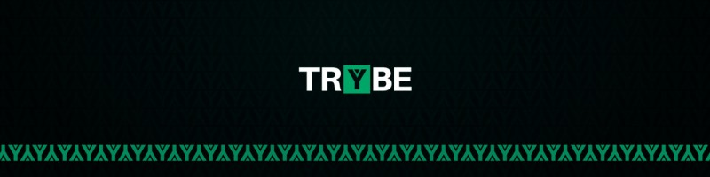
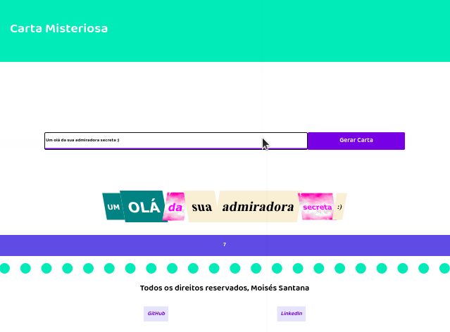
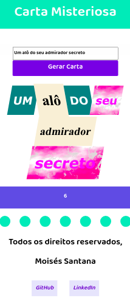

# Projeto Color Guess

Mistery Letter é um projeto idealizado pela Trybe onde temos como tarefa criar uma página web usando HTML5/CSS3/JavaScript, a página é um gerador de cartas misteriosas, contém um campo de texto, onde pode digitar sua carta e ao clicar no botão "gerar carta" cada palavra terá uma formatação diferente, e é mostrado abaixo do texto o número de palavras contém na sua carta.

## Técnologias utilizadas:

* HTML5
* CSS3
* JavaScript

### Crie suas cartas misteriosas no link abaixo:

https://moisessantana.github.io/mistery-letter/
